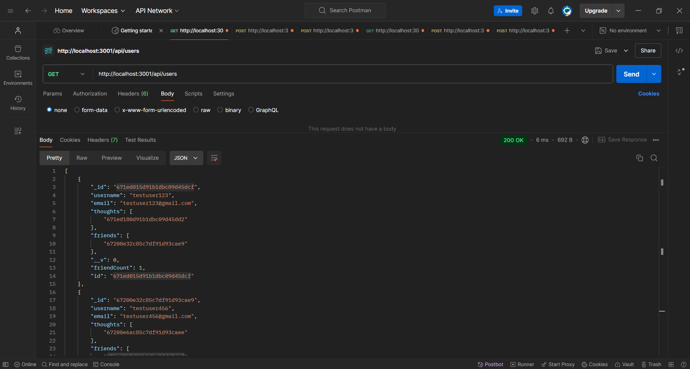

# Social Network API
[](https://opensource.org/licenses/MIT)
## Description
A social network API where you can utilize the routes to do CRUD operations for a user, thought, and reactions. <br>
Uses MongoDB as database and to store documents. Uses Mongoose to create models for user, thought, and reaction.<br>
No front end. <br>

Technologies used:<br>


## Table of Contents
- [Installation](#installation)
- [Usage](#usage)
- [Contributing](#contributing)
- [Questions](#questions)
- [License](#license)

## Installation

- The user must clone the repo locally with this command:
```bash
git clone https://github.com/PhilipMcF/Social-Network-API.git
```
- Node.JS will be needed as well as the package manager to acquire the necessary modules:<br>
https://nodejs.org/en/download/package-manager

- Npm modules are needed in order to function properly so they will need to be installed. Run this command in the root directory where the repo is installed:
```bash
npm install
```

## Usage

[Click here to watch walkthrough video!](https://drive.google.com/file/d/1dL1rr6ncrEXX_E22asbCAKS99H5x2jR-/view?usp=sharing)

[](https://drive.google.com/file/d/1dL1rr6ncrEXX_E22asbCAKS99H5x2jR-/view?usp=sharing)

To start the project, make sure you are in the root directory of the repo/project and run this command in a terminal window:
```bash
npm run start
```

The backend server is now running and you can test the routes with CRUD operations on the user, thought, and reaction models.<br>
Here are the routes available:
- http://localhost:3001/api/users
    - GET, POST
- http://localhost:3001/api/users/:userId
    - GET, PUT, DELETE
- http://localhost:3001/api/users/:userId/friends
    - POST
- http://localhost:3001/api/users/:userId/friends/:friendId
    - DELETE

- http://localhost:3001/api/thoughts
    - GET, POST
- http://localhost:3001/api/thoughts/:thoughtId
    - GET, PUT, DELETE
- http://localhost:3001/api/thoughts/:thoughtId/reacions
    - POST
- http://localhost:3001/api/thoughts/:thoughtId/reactions/reactionId
    - DELETE

## Contributing
[](https://www.contributor-covenant.org/version/2/1/code_of_conduct/)<br>
To contribute to this project, you can fork it or create an issue and provide any suggestions or solutions.
Please try and follow the Contributor Covenant code of conduct and leave a star if you like the project.

## Questions
For any and all questions, please contact me here:
- GitHub: https://github.com/PhilipMcF
- Email: philipsm1998@gmail.com

## License
[This project is licensed under the MIT license.](#https://opensource.org/license/mit)